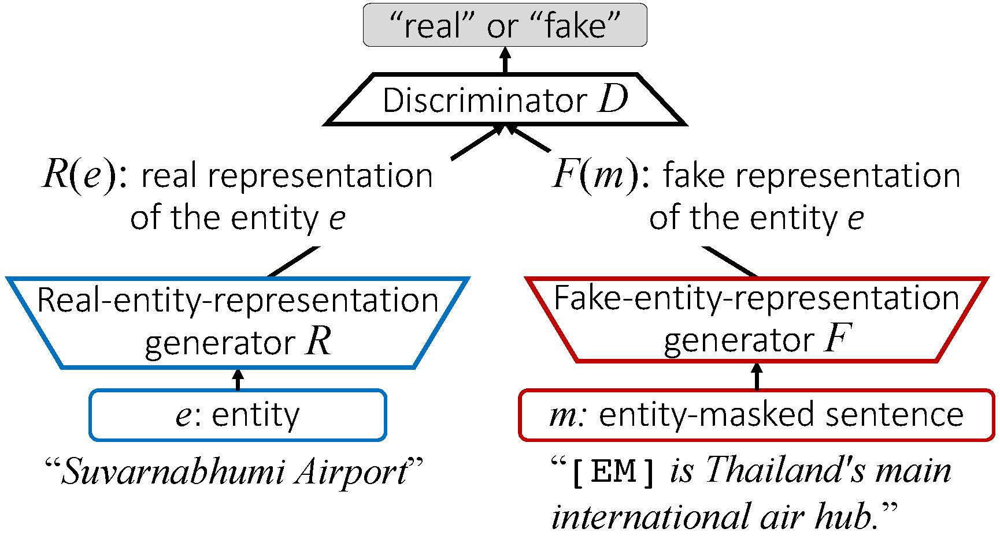

Adversarially pretrained CNN models
================
The following table lists up the nine CNN models pretrained using the settings described in our ACL-IJCNLP 2021 paper (see the [Pretraining settings](#pretraining_setting) section in this page for the details). They can be downloaded manually from this table or automatically by running the script `download_CNN_models.sh` in this fold. The file name of these pretrained CNNs is in the format of `cnn_{filter_windows}.{number_of_filters}.pt` (e.g., `cnn_1.2.3.4.100.pt`), where `filter_windows` and `number_of_filters` are the hyperparameters used for pretraining the CNN.

|Pretrained CNNs	 				     |filter windows | number of filters | 
|------------------------------------------|-----------------|-----------------|
|[cnn_1.2.3.4.100.pt](https://github.com/nict-wisdom/bertac/releases/download/cnn_1.2.3.4.100/cnn_1.2.3.4.100.pt)			     |"1,2,3,4"        |100        | 
|[cnn_1.2.3.4.200.pt](https://github.com/nict-wisdom/bertac/releases/download/cnn_1.2.3.4.200/cnn_1.2.3.4.200.pt)			     |"1,2,3,4"        |200        | 
|[cnn_1.2.3.4.300.pt](https://github.com/nict-wisdom/bertac/releases/download/cnn_1.2.3.4.300/cnn_1.2.3.4.300.pt)			     |"1,2,3,4"        |300        | 
|[cnn_1.2.3.100.pt](https://github.com/nict-wisdom/bertac/releases/download/cnn_1.2.3.100/cnn_1.2.3.100.pt)			     |"1,2,3"        |100        | 
|[cnn_1.2.3.200.pt](https://github.com/nict-wisdom/bertac/releases/download/cnn_1.2.3.200/cnn_1.2.3.200.pt)			     |"1,2,3"        |200        | 
|[cnn_1.2.3.300.pt](https://github.com/nict-wisdom/bertac/releases/download/cnn_1.2.3.300/cnn_1.2.3.300.pt)			     |"1,2,3"        |300        | 
|[cnn_2.3.4.100.pt](https://github.com/nict-wisdom/bertac/releases/download/cnn_2.3.4.100/cnn_2.3.4.100.pt)			     |"2,3,4"        |100        | 
|[cnn_2.3.4.200.pt](https://github.com/nict-wisdom/bertac/releases/download/cnn_2.3.4.200/cnn_2.3.4.200.pt)			     |"2,3,4"        |200        | 
|[cnn_2.3.4.300.pt](https://github.com/nict-wisdom/bertac/releases/download/cnn_2.3.4.300/cnn_2.3.4.300.pt)			     |"2,3,4"        |300        | 

## GAN-style pretraining 
CNNs are pretrained in a GAN (Generative Adversarial Network) style using three subnetworks as shown below: *R* (*real-entity-representation generator*), *F* (*fake-entity-representation generator*), and *D* (*discriminator*). 

*R* and *F* are CNNs with average pooling and *D* is a feedforward neural network. The network *F* generates a vector representation of the masked sentence (*m*), while *R* produces a vector representation of the masked entity (*e*). The discriminator *D* takes representations generated by either *R* or *F* as the input, and predicts which generator actually gave the representation. 

During the training, *R* and *D*, as a team, try to avoid being mimicked by *F* and also to make the mimic problem harder for *F*. On the other hand, *F* is trained so that, taking an entity-masked sentence as its input, it can generate a representation of the masked entity mention (called  a *fake representation of the entity*) that *D* cannot distinguish from the real representation. The representation generated by *R* is *fake* in the sense that the entity mention is masked in the input sentence and *F* cannot know what it is exactly. If everything goes well, once the training is over, *F* should be able to generate a fake representation of the entity that is similar to its real representation.

##  Pretraining settings

As the pretraining data, we used pairs of an entity mention and a masked sentence {(*e*, *m*)} that were automatically extracted from English Wikipedia as follows:

* [WikiExtractor](https://github.com/samuelbroscheit/wikiextractor-wikimentions) was used to extract Wikipedia sentences that have at least one entity mention, i.e., an entity with an internal Wikipedia link. 
* Then we randomly selected one entity mention *e* in each sentence and generated an entity-masked sentence *m* by replacing the entire selected mention with "[EM]". For example, we generated the masked sentence *m*, "[EM] is Thailand's main international air hub" by replacing the entity mention *e*, "Suvarnabhumi Airport", in the sentence *s* "Suvarnabhumi Airport is Thailand's main international air hub", with "[EM]." 
* 43.3 million pairs of an entity mention and a masked sentence were extracted from Wikipedia in this way. 10% of them was randomly sampled and used as training data (4.33 million pairs, around 700 MB in file size). 

For the pretraining, the [fastText word-embedding vectors](https://fasttext.cc/) pretrained on Wikipedia were used and they were fixed during the pretraining. We set the number of training epochs to 200 and did not use any early-stopping technique. We used the RmsProp optimizer with a batch size of 4,000, and a learning rate of 2e-4. Nine CNN models were trained with all combinations of the filter's window sizes ({"1,2,3", "2,3,4", "1,2,3,4"}) and number of filters ({100, 200, 300}) for the generators *F* and *R*. A logistic regression layer with sigmoid outputs was used as discriminator *D*. As in the above table for pretrained CNNs, the resulting pretrained CNNs were stored as `cnn_{filter_windows}.{number_of_filters}.pt` by using the CNN filter settings as their identifier. 

